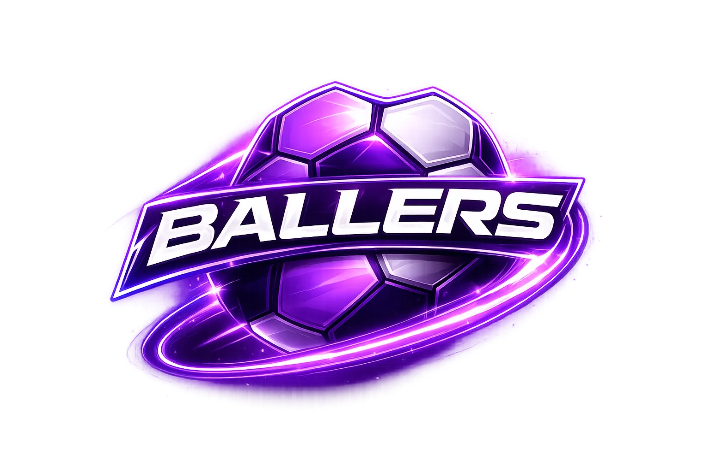
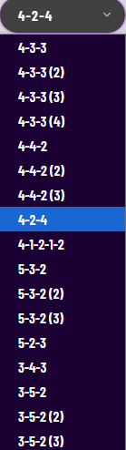
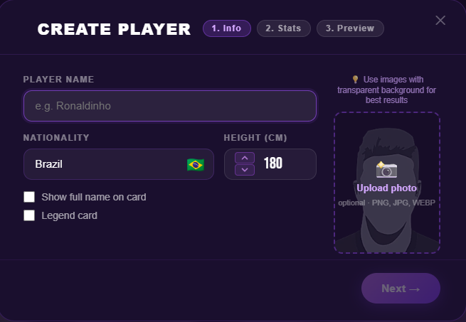
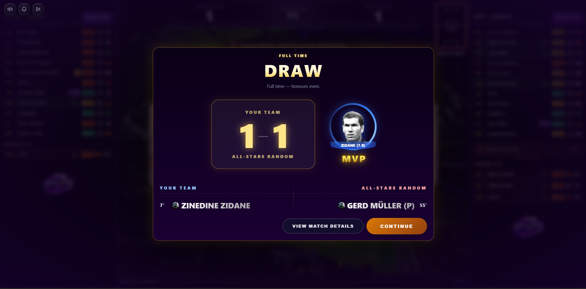

<div align="center">
  
</div>

# ⚽ Ballers • Interactive Football Experience

<p align="center">
  A browser-based football game combining **squad building**, **dynamic pack opening**, and a **custom-built interactive match engine** where you control every moment.
</p>

<p align="center">
  <a href="https://ballers-game.vercel.app/" target="_blank">
    
  </a>
  <a href="https://github.com/kiellzz/ballers-game/actions/workflows/match-engine.yml" target="_blank">
    
  </a>
</p>

---

## 🎯 Quick Start

> **[▶ Play now at ballers-game.vercel.app](https://ballers-game.vercel.app/)** — No installation, plays directly in the browser.

**Local Development:**
```bash
git clone https://github.com/kiellzz/ballers-game.git
cd ballers-game
npm install
npm run dev
```

---

## 🌟 Core Features

### 🎴 Pack Opening System
- **Tier-based cards** (Legend, Gold, Silver, Bronze)
- **Weighted probability** algorithms
- Animated reveals with visual feedback

### 👥 Squad Building & Lineup
- **Multiple formations** with drag & drop positioning
- **Bench system** with 5 substitutes
- **Random Fill button** to auto-populate the squad respecting positions
- **Favorites system** for quick player access
- **Real-time validation** of player positions

### ✏️ Custom Player Creation
- Multi-step modal (Info → Stats → Preview)
- **Photo upload** with built-in crop tool and background removal
- **Position-weighted overall** calculation
- Custom players protected from removal if active

### 🆚 Pre-Match System
- **Opponent selection**
- Full squad reveal before match starts

### ⚽ Interactive Match Engine
- **Player-driven decisions** (attack & defense each turn)
- **Duel-based gameplay** (attacker vs defender)
- **Zone-based progression** (midfield → final third → box)
- **Set pieces** (Penalty, Free Kick, Corner)
- **Full disciplinary system** (yellow/red cards, two yellows = red)
- **Persistent card tracking** for both teams
- **Sent-off players** removed from selection
- **Dynamic player ratings** impacted by every action

### 🏆 Post-Match System
- **Match summary** with goal scorers & assists
- **MVP selection** based on highest rating
- **Red cards** displayed in timeline
- **Penalty goals** tagged with **(P)**

### 📊 Player Rating System
- Starts at **6.0** for all players
- Micro-adjustments for every action
- **Duel-based** rating changes
- **Clean sheet bonus** (GK +1.0, DEF +0.6)
- **Discipline penalties** for cards and dismissals
- **Balanced** to avoid inflation

### 🎵 Audio & Immersion
- Music player with SFX
- Toggle controls
- Interactive feedback sounds

---

## 🚀 Recent Updates

* 🎰 **Random Fill Squad Button** - Auto-populate entire squad (pitch + bench) with random players respecting formations
* 🟥 **Full Disciplinary System** - Two yellows = red, GK protection (max one yellow), sent-off player tracking
* ⚖️ **Symmetric Foul Logic** - Mirrored situations use identical probabilities
* 🧤 **Big Chance Rebalance** - `rush_save` vs `wait` tradeoffs for goalkeeper one-on-ones
* 📉 **Discipline-Aware Ratings** - Cards and dismissals penalize player ratings
* ⚙️ **Randomized Match Clock** - 0–3 min/action (triangular), compressed late-game (85+)
* 🧪 **Calibration Test Suite** - Vitest + GitHub Actions on match-engine/

---

## 📸 Screenshots

### Home & Pack Opening
<div align="center">
  
  
</div>

### Squad Building & Lineup
<div align="center">
  
  
</div>

### Formations & Custom Players
<div align="center">
  
  
</div>

### Pre-Match & Match
<div align="center">
  
  
</div>

### Match Events & Summary
<div align="center">
  
  
</div>

---

## 🔧 Tech Stack

<p align="center">
  
  
  
  
  
  
</p>

---

## 🎮 Match Engine Overview

The **interactive match engine** is custom-built with:

- **Duel System**: Player vs player resolution using stats
- **Zone Progression**: Midfield → Final Third → Box → Big Chance
- **Event Resolver**: Success, fail, rebound, injury outcomes
- **Set Pieces**: Penalty, Free Kick (interactive + quick), Corner
- **Disciplinary Engine**: Foul resolution, card logic, dismissals
- **Player Selector**: Context-aware, excludes sent-off players
- **Player Rating**: Real-time micro-adjustments per action

**Gameplay Flow:**
1. Choose offensive or defensive action
2. System resolves duel (attacker stats vs defender stats)
3. Outcome determines progression (goal, turnover, set piece, card)
4. Next situation auto-generates
5. Match continues until 90 minutes

---

## 🚢 Deployment

Deployed on **Vercel** with automatic CI/CD.

```
Live: https://ballers-game.vercel.app/
```

---

## 📋 Project Structure

```
src/
├── components/          # UI components (home, lineup, match)
├── pages/              # Route pages
├── hooks/              # Custom logic hooks
├── match-engine/       # Core game engine
│   ├── core/           # matchEngine, duelEngine, eventResolver
│   ├── balancing/      # situationMaker, events, probabilites
│   ├── setpiece/       # Penalty, FK, corner
│   ├── fouls/          # Foul resolution
│   └── tests/          # Vitest calibration suite
├── data/               # Players database
├── types/              # TypeScript types
└── utils/              # Utilities (formations, rating, sound)
```

---

## 🗺 Roadmap

- [x] ⚔️ Interactive Match Engine
- [x] 🏆 Match Summary & MVP System
- [x] 📊 Player Rating System
- [x] 🟥 Cards System
- [x] 🚀 Deploy on Vercel
- [x] 🧪 Duel engine calibration test suite (Vitest + GitHub Actions)
- [x] ✏️ Custom Player Creation (crop, overall weights, squad protection)
- [x] 🔄 Substitution System
- [x] 📊 Advanced match stats 
- [ ] 🎮 Draft Mode
- [ ] 💾 API/Backend integration

---

## 👨‍💻 Author

Developed by **Ezequiel Borges**

- GitHub: [github.com/kiellzz](https://github.com/kiellzz)
- LinkedIn: [linkedin.com/in/ezequielborgesdev](https://www.linkedin.com/in/ezequielborgesdev)

> Interactive systems design with gameplay architecture, focusing on logic, scalability, and user experience.
