<div>

> 🚧 **Project Status:** In active development  
> ✅ Core match engine implemented  
> 🔄 Currently refining gameplay balance, UI synchronization, and interactions

# ⚽ Ballers Game • Interactive Football Experience

---

## 📝 Recent Updates

* ✨ **New Play Match Modal** - Direct match initiation interface
* 🗺️ **Match Map Tooltips** - Enhanced map interaction with contextual tips
* 📊 **Improved Player Rating System** - Fine-tuned rating calculations for better balance
* 🎲 **Pack Probability Refinements** - Enhanced weighted probability algorithms
* 🎨 **UI Refinements** - CSS and component optimizations across home, lineup, and match screens
* 🔧 **Build Utilities** - Added resize.cjs for image processing
* 🎵 **Music Library Updates** - Streamlined audio collection

---

</div>

<p align="center">
  
  
  
  
  
  
</p>

<p align="center">
  <a href="https://ballers-game.vercel.app/" target="_blank">
    
  </a>
</p>

<div>

Ballers is a web-based football application focused on **interaction, squad building, and gameplay systems**, inspired by modern football games like EA FC/FIFA Ultimate Team.

It combines high-quality UI/UX with a **custom-built interactive match engine**, delivering a dynamic and immersive football experience directly in the browser.

[Live Demo](#-live-demo) • [Features](#-features) • [Match Engine](#-interactive-match-engine) • [Preview](#-preview) • [Running Locally](#%EF%B8%8F-running-locally) • [Roadmap](#-roadmap)

</div>

---

## 🌐 Live Demo

> **[▶ Play now at ballers-game.vercel.app](https://ballers-game.vercel.app/)**

Deployed on **Vercel** — no installation required, runs directly in the browser.

---

## 🎯 Project Goal

* Simulate an engaging football squad-building and gameplay experience.
* Practice advanced frontend architecture with **React + TypeScript**.
* Build a **state-driven interactive system**, not just static UI.
* Develop a scalable foundation for complex gameplay mechanics.

---

## 🚀 Features

* 🎴 **Dynamic Pack Opening System**
    * Tier-based cards (Legend, Gold, Silver, Bronze).
    * Weighted probability algorithms.
    * Animated card reveals.

* 👥 **Advanced Squad Building**
    * Multiple tactical formations.
    * Drag & drop positioning.
    * Bench and substitutions.

* 🎯 **Deep Player Interaction**
    * Detailed stat modals.
    * Quick swap/remove.
    * Favorites system.

* 🔎 **Robust Filtering**
    * Filter by rating, tier, position, nationality.
    * Real-time updates.

* 🆚 **Pre-Match System**
    * Opponent selection
    * Squad reveal

* ⚽ **Interactive Match Engine**
    * Player-driven decisions (attack & defense)
    * Duel-based gameplay system
    * Zone-based match progression
    * Real-time event resolution

* 🏆 **Match Summary & MVP System**
    * Post-match summary modal with delay
    * Displays result (win/draw/loss)
    * Goal scorers and assists for both teams
    * MVP selection based on **highest rating in the match**
    * Tie-breaking logic (winner priority or random fallback)
    * Penalty goals tagged with **(P)**

* 📊 **Dynamic Player Rating System**
    * Base rating starts at **6.0 for all players**
    * Every action impacts rating (+/- micro adjustments)
    * Duel-based rating impact (winner gains, loser loses)
    * Offensive players penalized for missed chances
    * Defensive line impacted when conceding goals
    * Clean sheet bonus:
      * GK → +1.0
      * DEF → +0.6
    * Enhanced goalkeeper logic:
      * Saves, high saves, penalty saves
      * Weak goal detection (long shots)
    * Balanced to avoid rating inflation

* 🎬 **Smooth UI Animations**
    * Powered by **Framer Motion**
    * Transition-based UI feedback
    * Animated modals and match elements

* 🔊 **Audio & Immersion**
    * Music player
    * SFX feedback
    * Toggle controls

---

## ⚽ Interactive Match Engine

Ballers features a **custom-built interactive match engine** where the user actively participates in every phase of the game.

### 🎮 Core Concept

Instead of passive simulation:

- You choose **offensive actions** when attacking  
- You choose **defensive reactions** when defending  
- Every moment is resolved through **player vs player duels**

---

### 🧠 Engine Systems

- **Zone-based gameplay**
  - Midfield, final third, box, big chances, etc.

- **Duel Engine**
  - Resolves attacker vs defender using player stats

- **Event Resolver**
  - Determines outcomes (success, fail, rebound, etc.)

- **Set Piece Engine**
  - Penalty
  - Free Kick (interactive + quick flow)
  - Corner kicks

- **Player Selector**
  - Context-aware player selection
  - Position-based filtering (no secondary position abuse)

---

### ⚡ Gameplay Flow

- Continuous chain of **duels**
- Context-sensitive actions
- Real-time progression
- Player decisions directly influence outcomes

---

### 📜 Match Event Log

A real-time duel-based log system

Examples:

```
User Player vs GK Opponent → Finish → Goal
Opponent Winger vs User CB → Sprint → Stopped
FK taker vs GK → Free Kick → Saved
```

Features:

- Fully **duel-based structure**
- Includes:
  - Open play
  - Penalty
  - Free Kick
  - Corner
- Compact horizontal layout
- Uses player mini-cards (UI consistency with lineup)
- Smart name formatting (`getDisplayName`)
- Scrollable + customizable UI
- Optional visibility (can be hidden for cleaner gameplay)

---

### 🎯 UI & Interaction

- Interactive modals:
  - Penalty
  - Free Kick
  - Corner
  - Match Summary

- Visual feedback:
  - Action → Outcome transitions
  - Ball animations
  - Goal modal
  - Goal scorers & assisters in the sidebar
  - MVP highlight in post-match

- Strong UI consistency:
  - Same card system across lineup + match
  - Mini cards in event log
  - Player ratings visible in lineup

---

### ⚖️ Balancing & Realism

- Tuned probabilities for:
  - Goals
  - Rebounds
  - Clearances
  - Fouls

- Improvements:
  - Reduced unrealistic rebounds
  - More realistic corner generation
  - Better possession retention
  - Goalkeeper logic adjustments
  - Fair rating distribution across all positions

---

## 📸 Preview

### 🏠 Home & Navigation
<div align="center">
  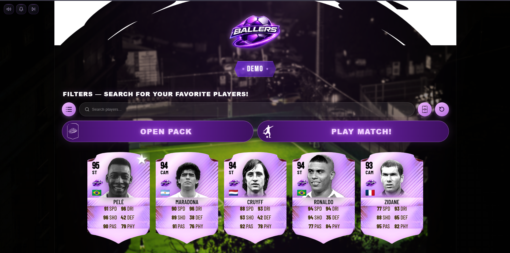
  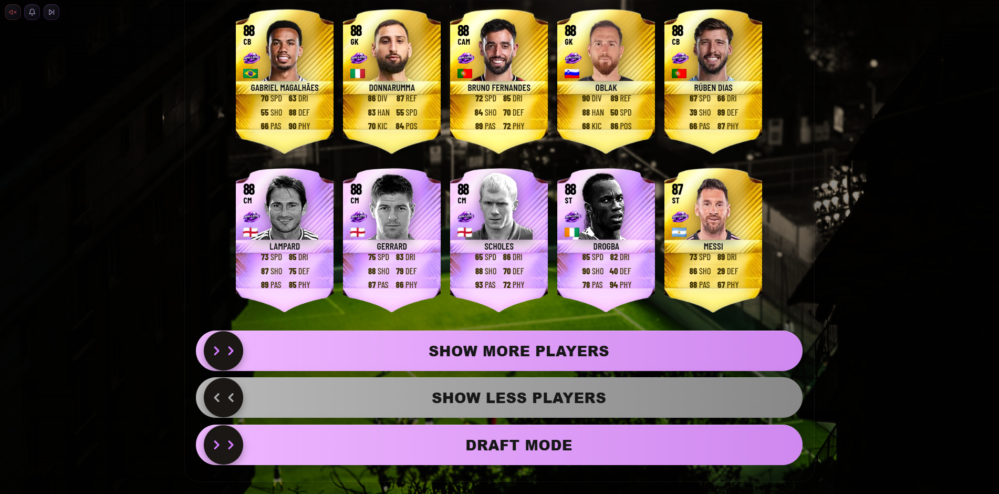
</div>

### 🎴 Pack Opening & Filters
<div align="center">
  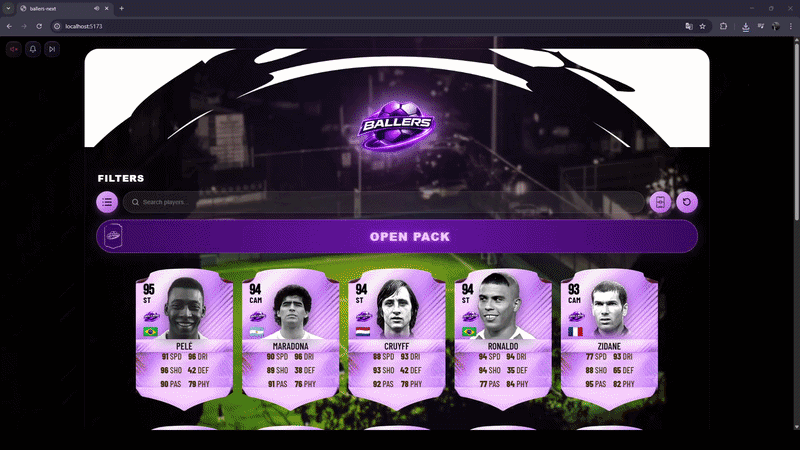
  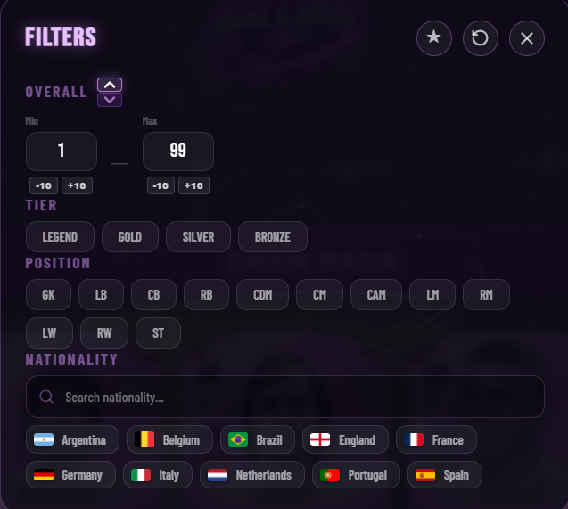
</div>

### 👥 Squad & Lineup System
<div align="center">
  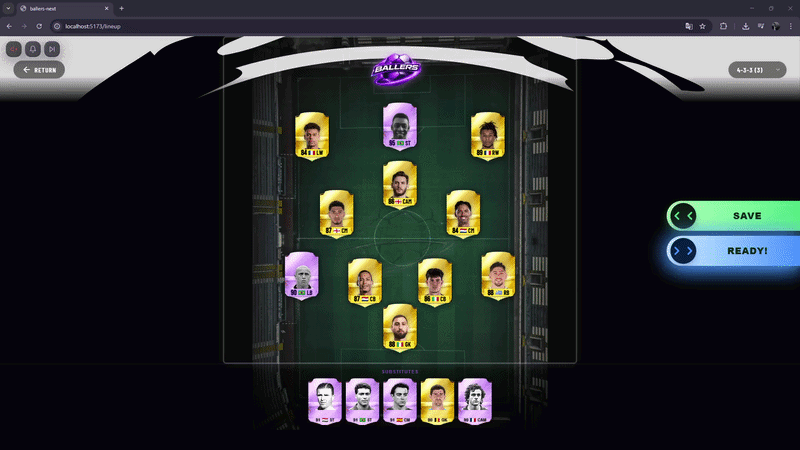
  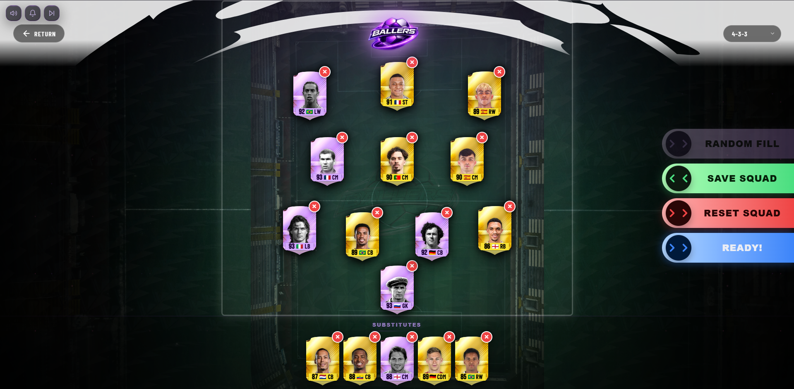
</div>

### 🎯 Player Interaction
<div align="center">
  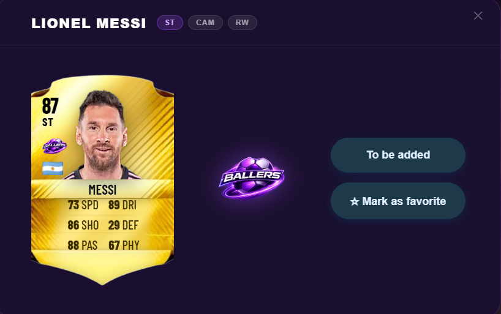
  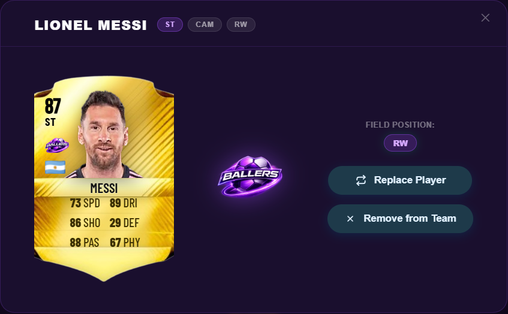
</div>

### 🆚 Pre-Match
<div align="center">
  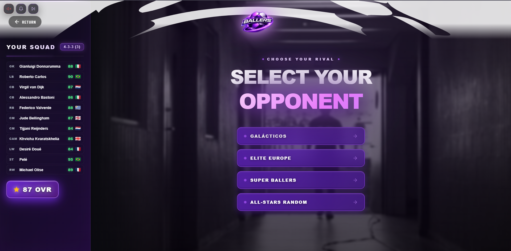
  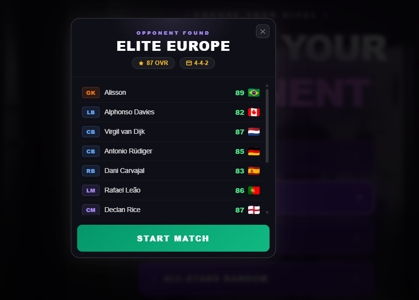
</div>

---

### ⚽ Match Engine & Gameplay

Interactive, decision-based match flow powered by a custom engine.

<div align="center">
  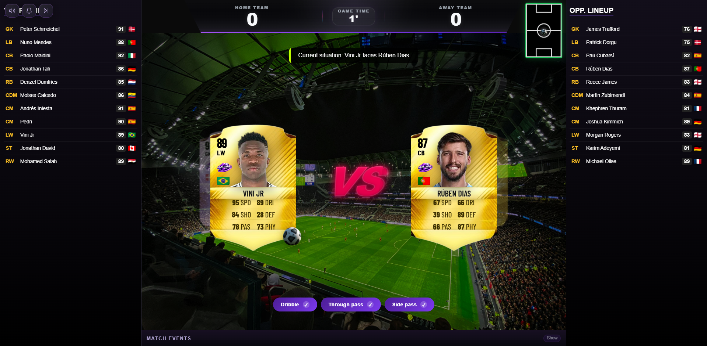
  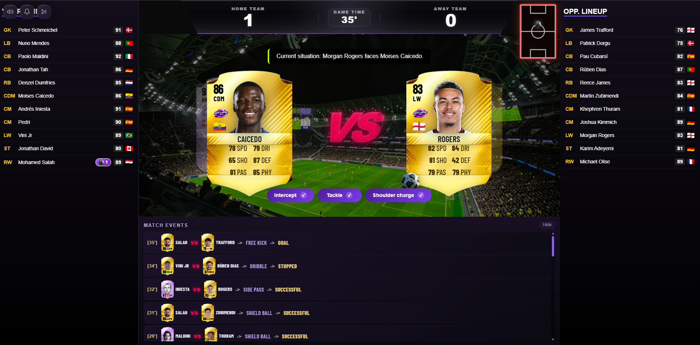
</div>

---

## 🛠 Architecture

* **Component-based UI**
* **Custom hooks for logic separation**
* **Utility-driven systems**
* **Game Engine Layer:**
  - matchEngine
  - duelEngine
  - eventResolver
  - setPieceEngine
  - playerRating
* **Separation of concerns:**
  - Engine logic vs UI layer
* **State-driven gameplay loop**

---

## ⚙️ Running Locally

```bash
git clone https://github.com/kiellzz/ballers-game.git
cd ballers-game
npm install
npm run dev
```

App: http://localhost:5173

---

## 🚢 Deploy

Deployed on **Vercel** with automatic CI/CD — every push to `main` triggers a new production build.

```
Live: https://ballers-game.vercel.app/
```

---

## 🗺 Roadmap

- [x] ⚔️ Interactive Match Engine
- [x] 🏆 Match Summary & MVP System
- [x] 📊 Player Rating System
- [x] 🚀 Deploy on Vercel
- [ ] 📊 Advanced match stats 
- [ ] 🎮 Draft Mode
- [ ] 💾 API/Backend integration 

---

## 👨‍💻 Author

Developed by **Ezequiel Borges**

- GitHub: [github.com/kiellzz](https://github.com/kiellzz)
- LinkedIn: [linkedin.com/in/ezequielborgesdev](https://www.linkedin.com/in/ezequielborgesdev)

> This project represents the transition from building UI applications to designing interactive systems with real gameplay structure, focusing on architecture, logic, and user experience.